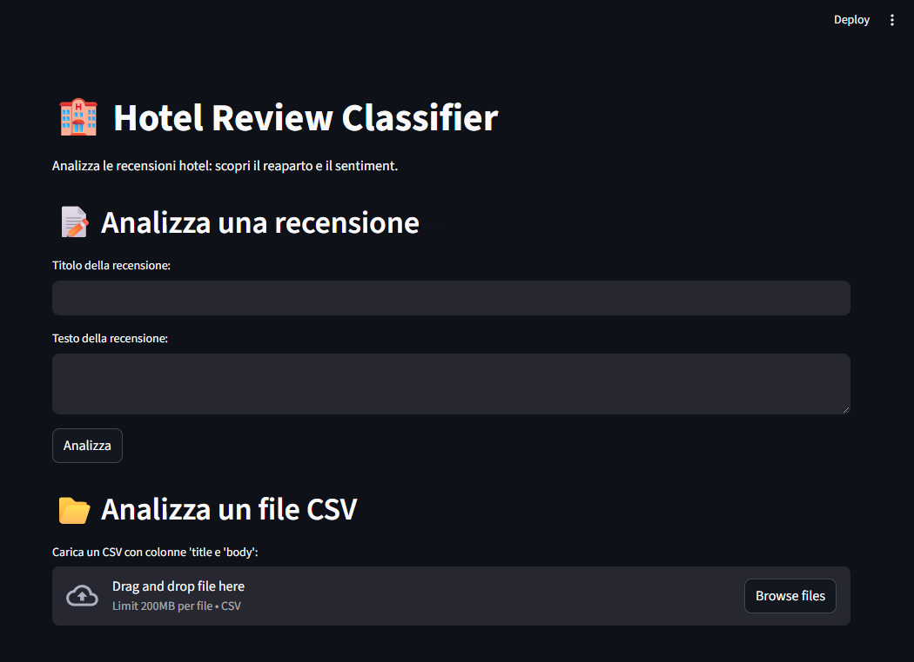

# Automated Hotel Review Management System with Machine Learning

Progetto di Machine Learning per la classificazione automatica di recensioni hotel per reparto e sentiment.

relaizzato come Project Work per il Corso di Laurea L-31 Informatica per le Aziende Digitali - Università Pegaso.

---

## Descrizione

Le strutture ricettive ricevono numerose recensioni su più canali.
Questo progetto realizza un prototipo che:

- Classifica ogni recensione nel reparto corretto (Housekeeping, Reception, F&B)
- Stima il sentiment (positivo/negativo) con probabilità
- Fornisce una dashboard interattiva per analisi singola e in batch

---

## Struttura del progetto

hotel-review-ml/
    data/
        reviews.csv
        reviews_with_predictions.csv
        confusion_matrices.png
    models/
        model_department.pkl
        model_sentiment.pkl
    scripts/
        generate_dataset.py
        train_model.py
    dashboard/
        app.py
    report/
    README.md

---

## Installazione 

### 1. Clona il repository

git clone https://github.com/tonyxviii/hotel-review-ml.git
cd hotel-review-ml

### 2. Installa le dipendenze

python -m pip install pandas scikit-lear matplotlib streamlit joblib

## Esecuzione

### Passo 1 - Genera il dataset

python scripts/generate_dataset.py

Genera 300 recensioni sintetiche e le salva in data/reviews.csv

### Passo 2 - Addestra i modelli 

python scripts/train_model.py

Addestra i modelli ML e salva i risultati in models/

### Passo 3 - Avvia la dashboard 

streamlit run dashboard/app.py

Apre la dashboard nel browser su hattp://localhost:8501

---

## Risultati

| Modello | Accuracy | F1 Macro |
| --- | --- | --- |
| Classificazione Reparto | 96.77% | 96.86%|
| Analisi Sentiment | 100% | 100% |

---

## Tecnoligie utilizzate

- Python 3.14
- pandas - gestione dati
- scikit-lear - Machine Learning
- matplotlib - grafici
- streamlit - dashboard interattiva 
- joblib - salvataggio modelli

---

## Autore 

Antonio Mercuri - Matricola: 0312300891
GitHub: https://github.com/tonyxviii
Università Telematica Pegaso - L-31

---

## Come funziona il Machine Learning

### TF-IDF (Term Frequency - Inverse Document Frequency) 
Il testo delle recensioni viene trasformato in numeri tramite TF-IDF. In pratica, ogni parola ottiene un punteggio basato su: 
- **TF**: quanto spesso appare in una recensione
- **IDF**: quanto è rara nel dataset generale

Parole comuni come "the" o "a" ottengono punteggi bassi.
Parole specifiche come "housekeeping" o "breakfast" ottengono punteggi alti e diventano i segnali più importanti.

### Regression Logistica 
È l'algoritmo scelto per classificare sia il reparto che il sentiment. Nonostante il nome, è un algoritmo di classificazione.
Impara a riconoscere quali combinazioni di parole portano a una certa etichetta (es. "dirty" + "bathroom" -> Housekeeping + negative).

Vantaggi:
- Semplice e interpretabile
- Funziona molto bene con testo traformato in TF-IDF 
- Veloce da addestrare anche su dataset piccoli
- Restituisce probabilità (confidenza) oltre alla predizione 

### Pipeline scikit-learn
I due passi (TF-IDF + Regressione Logistica) sono uniti in una Pipeline di scikit-learn. 
Questo garantisce che il processing e il modello vengano sempre applicati nello stesso ordine, sia in fase di training che di produzione.

---

## Screenshot Dashboard

---

## Esempi di recensioni e risultati 

| Titolo | Testo | Reparto predetto | Sentiment predetto |
|---|---|---|---|
| Dirty room | The bathroom was disgusting and the floor was full of dust | Housekeeping | negative |
| Great breakfast | The buffet was amazing, fresh food every morning | F&B | positive|
| Friendly staff | Check-in was fast and the receptionist was very kind | Reception | positive |
| Cold food | Dinner was bland and arrived cold at our table | F&B | negative |

---

## Descrizione dettagliata dei file

### scripts/generate_dataset.py
Genera il dataset sintetico di 300 recensioni in inglese. Ogni recensione ha titolo, testo, reparto e sentiment.
Le recensioni sono bilanciate: 100 per reparto, 150 positive e 150 negative. Esporta il file data/reviews.csv.

### scripts/train_model.py
Legge il CSV, prepara i dati, addestra due modelli separati (uno per il reparto, uno per il sentiment) e li valuta con
accuracy, F1 macro e confusion matrix. Salva i modelli addestrati nella cartella models/ come file .pkl.

### dashboard/app.py
Interfaccia web costruita con Streamlit. Permette di analizzare una recensione singola inserendo titolo e testo, oppure di
caricare un CSV in batch. Mostra reparto, sentiment e percentuale di confidenza. Permette di esportare i risultati.

### data/reviews.csv
Dataset sintetico generato dallo script. Contiene 300 recensioni con colonne: id, title, body, department, sentiment.

### data/reviews_with_predictions.csv
Lo stesso dataset con due colonne aggiuntive: pred_department e pred_sentiment, contenenti le predizioni del modello.

### data/confusion_matrices.png
Grafici che mostrano le performance dei modelli sul test set. La diagonale rappresenta le predizioni corrette.

### models/model_department.pkl
Modello addestrato per la classificazione del reparto. Salvato con joblib per essere ricaricato dalla dashboard.

### models/model_sentiment.pkl
Modello addestrato per l'analisi del sentiment. Salvato con joblib per essere ricaricato dalla dashboard.

---

## Badge

